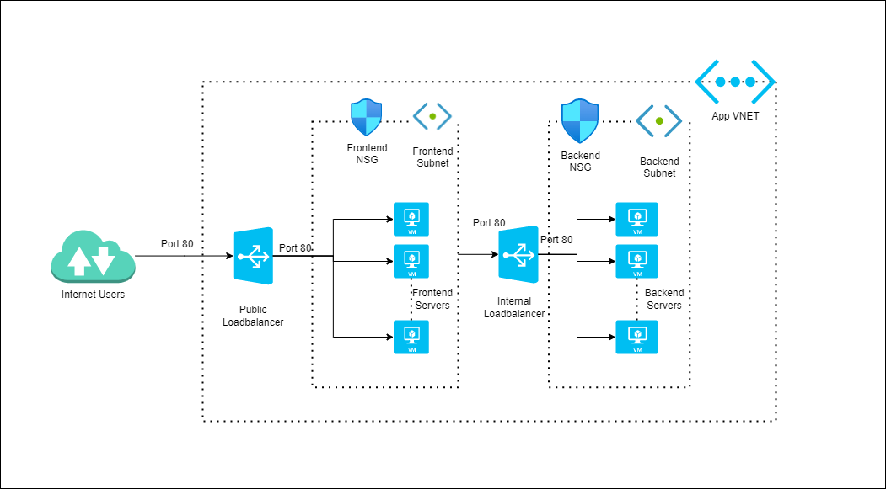

# Terraform Level Up - Final Assignment

## Azure Users

Create the required terraform configuration for the below infrastructure

**Instructions:** 

* Fork this [repo](https://gitlab.endava.com/Sivakumar.Palanisamy/tf-level-up-assignment-azure) in your gitlab workspace and do the changes in the level-up-infra folder of your fork(You should be connected to endava's VPN for accessing gitlab)
* The level-up-infra will be your root module and you can use the level-up-infra/modules for creating any dependent modules
* Your root module will be tested by us from the test folder. 
* Your root module should define the below variables  

  | Variable Name                  |
  |--------------------------------|
  |  use_existing_rg               | 
  |  resource_group_name           |
  |  location                      |
  |  vnet_address_space            |
  |  number_of_frontend_instances  |
  |  frontend_vm_size              |
  |  frontend_port                 |
  |  frontend_subnet_address_space |
  |  number_of_backend_instances   |
  |  backend_vm_size               |
  |  backend_port                  |
  |  backend_subnet_address_space  |

* Your root module should define the below outputs  

  | Output Name                       |
  |-----------------------------------|
  |  frontend_lb_public_ip            | 
  |  frontend_vms_private_ip_addresses|
  |  backend_vms_private_ip_addresses |

  
  
  

